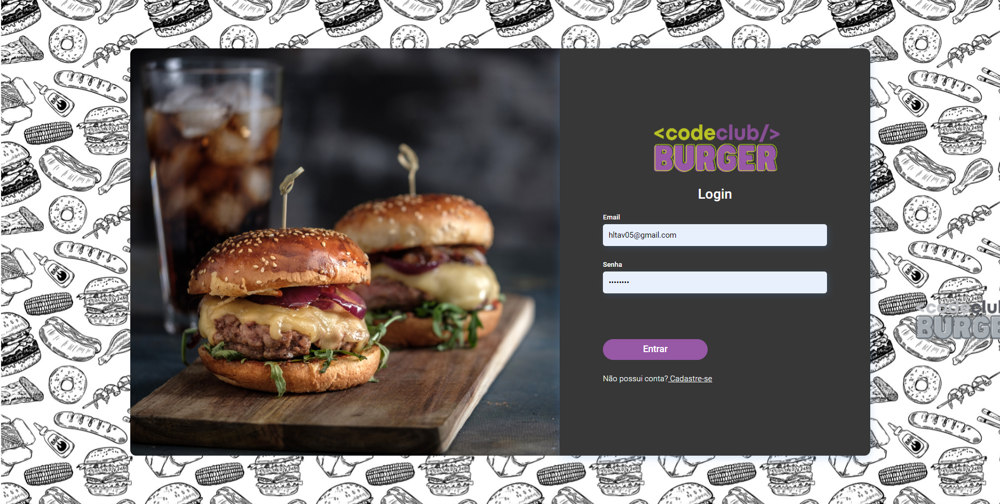
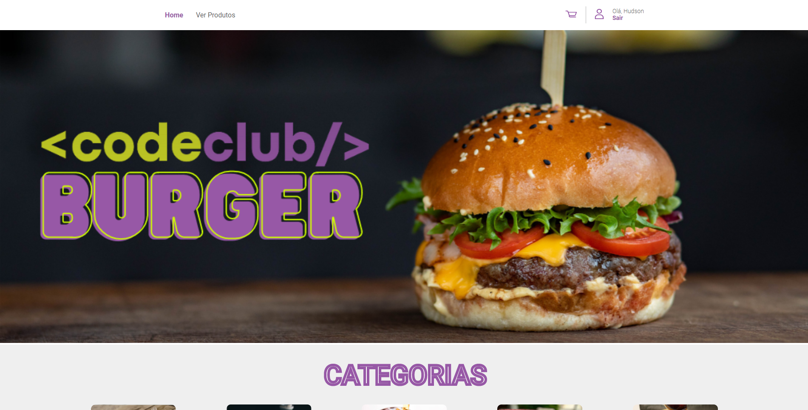
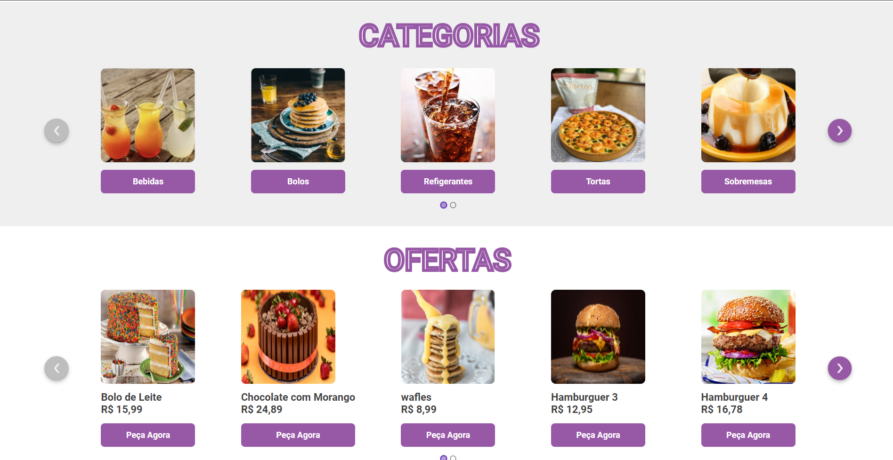
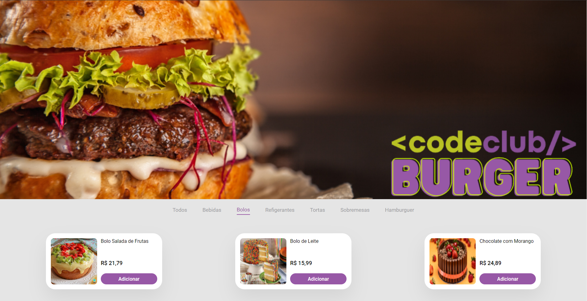
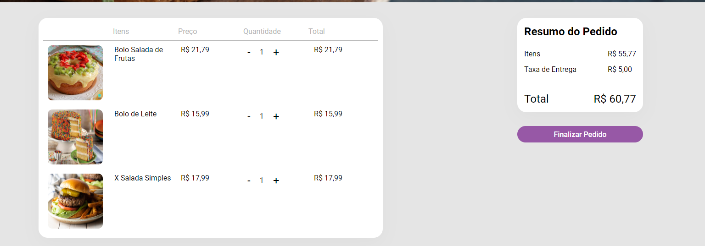
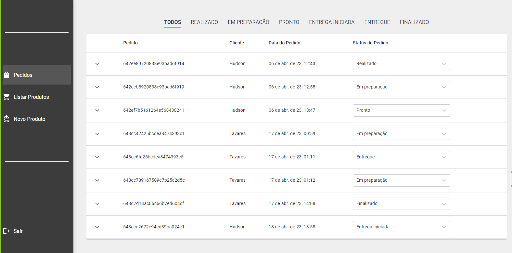
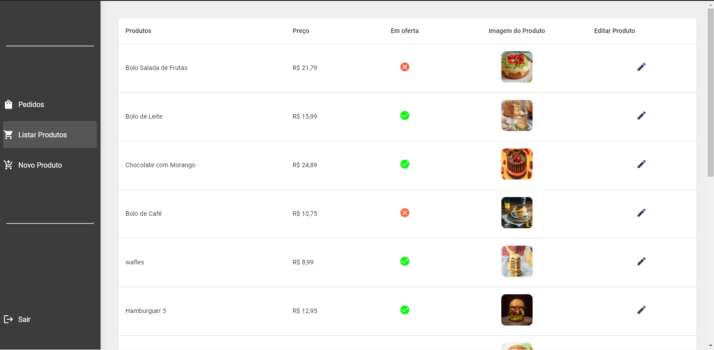
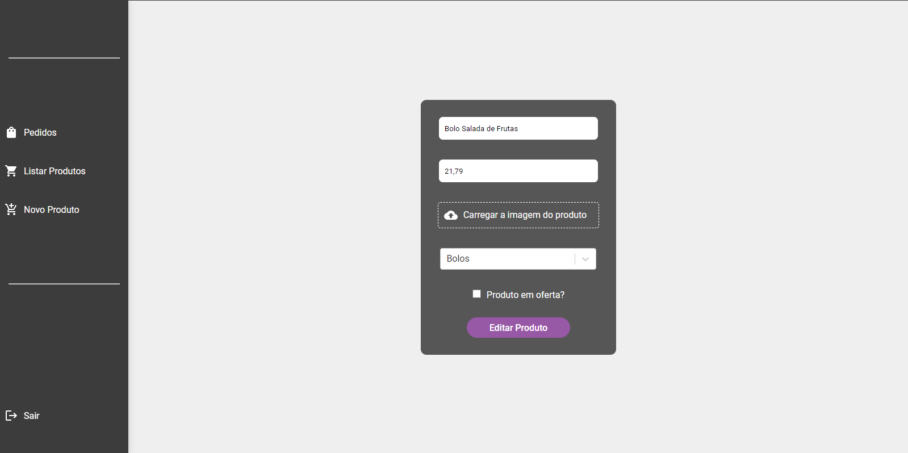
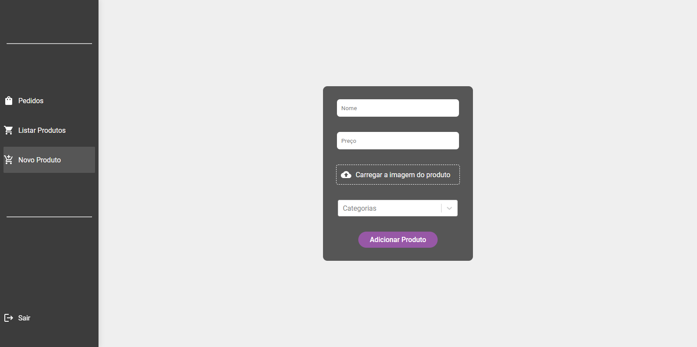

<h1>Codeburger</h1>

Este é um projeto de uma hamburgueria online onde é possível criar um cadastro de usuários,
visualizar os preços e escolher produtos, adicionar e remover itens do carrinho de compras e
gerenciar o conteúdo do cardápio através da tela de administração.

Página de Login

<h2>Páginas para usuário</h2>

Página de Home

Página de Produtos

Página de Carrinho

<h2>Páginas para Admin</h2>

Página de Pedidos

Página de Produtos Cadastrados

Página de Edição de Produtos

Página de Adição de Produtos

<h2>Tecnologias utilizadas</h2>

Este projeto foi desenvolvido utilizando as seguintes tecnologias:

HTML CSS JavaScript Node.js Express.js Sequelize Postgres SQL

<h1>Como utilizar:</h1>

Para utilizar este projeto em sua máquina local, siga os passos abaixo:

Faça o download ou clone este repositório para sua máquina.

Certifique-se de ter o Node.js instalado em sua máquina.

Na pasta raiz do projeto, instale as dependências com o comando yarn install.

Execute o comando yarn start para iniciar a aplicação.

Acesse a aplicação em seu navegador através do endereço http://localhost:3000.

<h1> Funcionalidades </h1>

<h2>Funcionalidades</h2>

Na tela inicial da aplicação, é possível criar uma conta de usuário preenchendo um formulário com
nome, email e senha.

<h2>Visualização de preços e escolha de produtos</h2>

Após realizar o login, o usuário tem acesso à tela de cardápio, onde pode visualizar os preços e
escolher os produtos que deseja adicionar ao carrinho de compras.

<h2>Carrinho de compras</h2>

Na tela de carrinho de compras, é possível adicionar e remover itens, além de visualizar o total a
ser pago pelos produtos selecionados.

<h2>Tela de administração</h2>

Na tela de administração, é possível gerenciar o conteúdo do cardápio, editando os preços dos
produtos já existentes, adicionando novos produtos e removendo produtos existentes.

<h1>Contribuição</h1>

Este projeto é de código aberto e qualquer contribuição é bem-vinda. Se você encontrar um bug ou
tiver uma ideia de melhoria, por favor, crie uma issue neste repositório. Se você deseja contribuir
com código, por favor, abra uma pull request e descreva suas alterações em detalhes.
